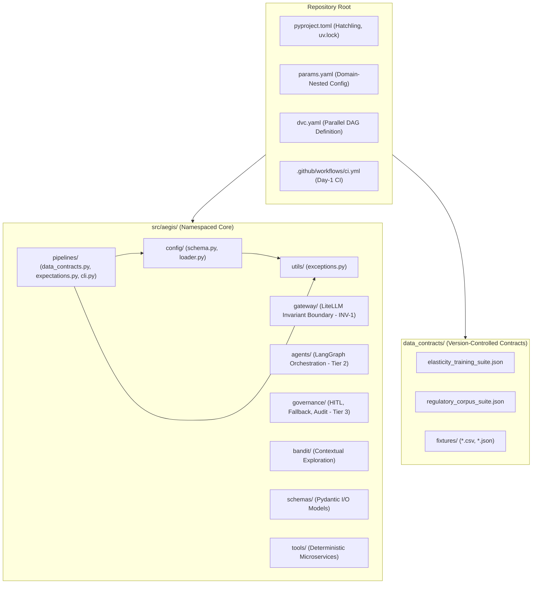
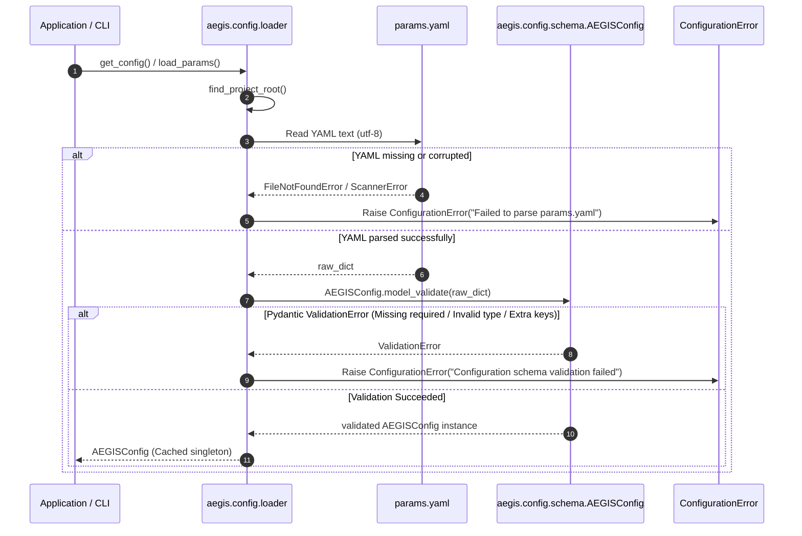
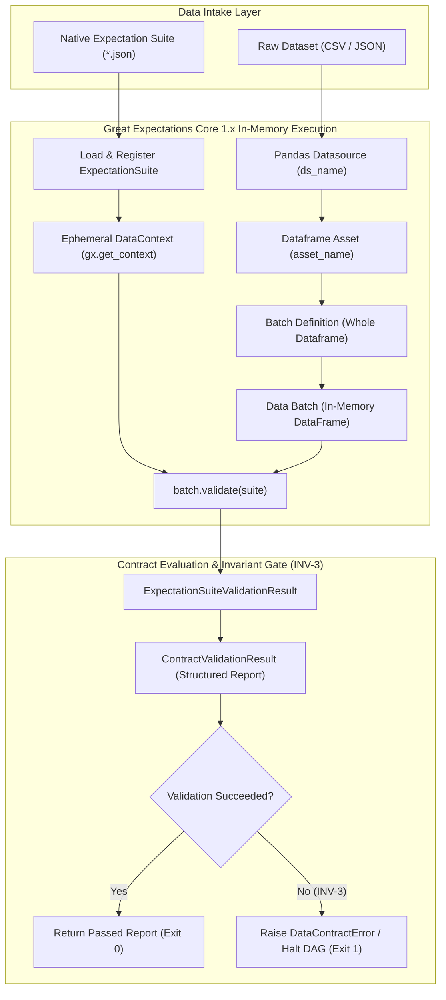
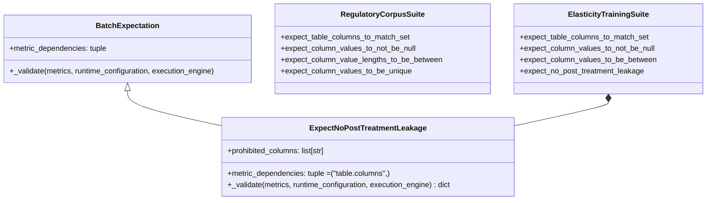
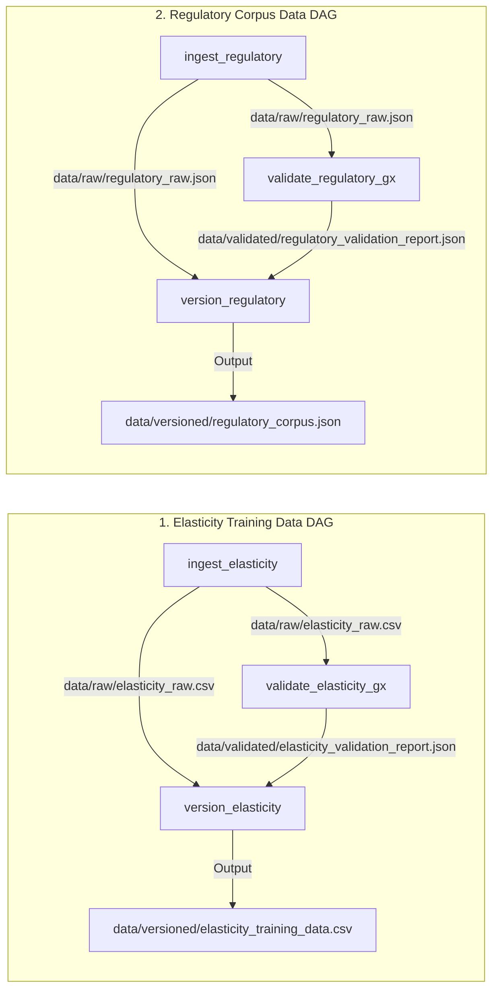
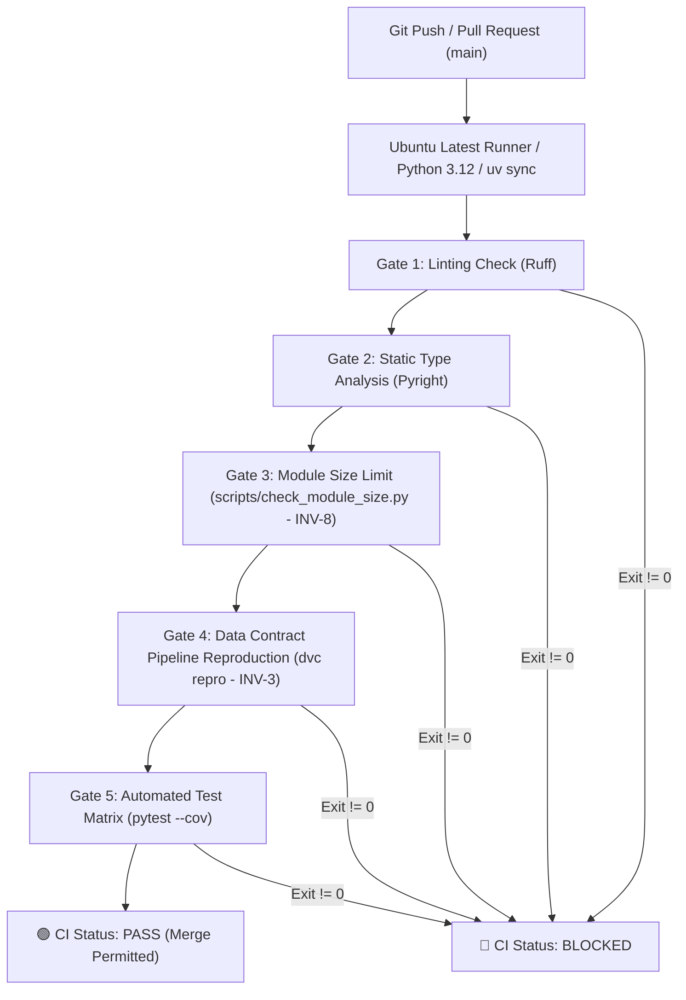

# Phase 1 Architecture Report — AEGIS

> **System:** Actuarial Elasticity & Governance Intelligence System (AEGIS)  
> **Phase:** Phase 1 — Project Scaffolding & Data Contracts  
> **Status:** 🟢 Validated & Complete  
> **Author:** Sebastián Garrido Arévalo | Date: August 21, 2026  
> **Related Documents:** [system_design.md](system_design.md), [phase_1_evaluation_report.md](../evaluations/phase_1_evaluation_report.md), [test_suite_report.md](../evaluations/test_suite_report.md), [phase_1_implementation_plan.md](../decisions/phase_1_implementation_plan.md)

---

## 1. Executive Summary & Architectural Scope

Phase 1 establishes the foundational infrastructure, dependency isolation, typed configuration engine, and data contract gating required to prevent corrupted, unvalidated, or causally contaminated data from entering AEGIS.

The core architectural imperative of Phase 1 is **Governance Over Raw Execution**: establishing day-one enforcement of non-negotiable invariants (**INV-1 through INV-10**), ensuring every dataset is contractually validated before versioning (**INV-3**), enforcing a 1,000-line modularity ceiling (**INV-8**), and providing a fully reproducible, zero-secrets continuous integration pipeline.

```
+---------------------------------------------------------------------------------------+
|                                    AEGIS REPOSITORY                                   |
|                                                                                       |
|  [ pyproject.toml / uv.lock ] ──────> [ params.yaml ] ──────> [ Pydantic v2 Schema ]  |
|         (Hatchling Backend)                 (Zero Secrets)               (Type Safety)|
|                                                                                       |
|  [ Data Contracts (GX Core) ] ──────> [ Custom Expectation ] ──> [ DVC Parallel DAG ] |
|     (JSON Declarative Suites)            (Causal Leakage Check)       (Fine-Grained)  |
|                                                                                       |
|  [ Scripts / Tooling ] ─────────────> [ Pytest Unit Matrix ] ──> [ GitHub Actions CI ]|
|       (INV-8 Line Check)                 (34 Tests, 94% Cov)          (Blocking Gates)|
+---------------------------------------------------------------------------------------+
```

---

## 2. Granular System Diagrams

### 2.1 Package Namespacing & Subsystem Topology

Per **ADR-004**, all source code is namespaced under `src/aegis/` to prevent top-level module collisions and enable clean package distribution via Hatchling.



---

### 2.2 Domain-Nested Configuration Architecture (ADR-005)

Configuration is consolidated in `params.yaml` with strict, fail-loud Pydantic validation on load.



---

### 2.3 Great Expectations Core 1.x Validation Flow (ADR-006)

Data contracts use ephemeral in-memory sessions without external cloud dependencies.



---

### 2.4 Custom Causal Leakage Expectation Metamodel

To enforce econometric validity in Tier 1 modeling, `ExpectNoPostTreatmentLeakage` intercepts post-treatment proxy variables before causal elasticity estimation.



---

### 2.5 DVC Parallel DAG Topology (ADR-007)

Two independent, parallel 3-stage workflows enforce fine-grained caching and contract execution.



---

### 2.6 GitHub Actions Continuous Integration Flow (ADR-008)



---

## 3. Design Patterns & Architectural Decisions

| Pattern                                  | Implementation                                                             | Architectural Rationale                                                                                                                                   |
| ---------------------------------------- | -------------------------------------------------------------------------- | --------------------------------------------------------------------------------------------------------------------------------------------------------- |
| **Domain-Nested Typed Configuration**    | [src/aegis/config/schema.py](src/aegis/config/schema.py)                   | Eliminates flat key namespace collision; validates all configuration parameters at startup with typed Pydantic models.                                    |
| **Declarative File-Based Contracts**     | [data_contracts/\*.json](data_contracts/)                                  | Decouples data validation rules from imperative application code; expectation suites are versioned natively in Git.                                       |
| **Custom Batch Expectation AST**         | [src/aegis/pipelines/expectations.py](src/aegis/pipelines/expectations.py) | Allows domain-specific econometric validation (prohibiting post-treatment feature leakage) while maintaining 100% JSON suite serialization compatibility. |
| **Dynamic CLI Configuration Resolution** | [src/aegis/pipelines/cli.py](src/aegis/pipelines/cli.py)                   | CLI argument defaults resolve lazily from `params.yaml` via `get_config()`, eliminating path duplication and preventing silent drift.                     |
| **Isolated Rule Failure Design**         | [data_contracts/fixtures/](data_contracts/fixtures/)                       | Every malformed test fixture trips specifically and exclusively one single named expectation, ensuring unambiguous failure diagnosis.                     |
| **Fail-Loud Exception Hierarchy**        | [src/aegis/utils/exceptions.py](src/aegis/utils/exceptions.py)             | All system exceptions derive from `AEGISError`, formatting detailed key-value metadata payloads for deterministic stack traces.                           |

---

## 4. Invariant Enforcement Matrix

| Invariant ID | Requirement                                                 | Enforcement Mechanism                                                  | Phase 1 Verification                                                         |
| :----------- | :---------------------------------------------------------- | :--------------------------------------------------------------------- | :--------------------------------------------------------------------------- |
| **INV-1**    | Gateway exclusivity (No raw LLM imports)                    | Directory isolation & upcoming CI import boundary check                | Gateway stub initialized; zero external provider SDKs imported.              |
| **INV-2**    | Single vector store (Redis Stack / RedisVL only)            | CI dependency check                                                    | `pyproject.toml` contains zero secondary vector databases.                   |
| **INV-3**    | Data contracts are blocking (GX gates DVC versioning)       | `cli.py`, `dvc.yaml`, `validate_dataframe()` raise `DataContractError` | Ingesting bad data halts `dvc repro` and prevents promotion to `versioned/`. |
| **INV-8**    | Module size ceiling (Max 1,000 lines per file under `src/`) | `scripts/check_module_size.py` in CI Gate 3                            | All 16 source files scanned: max size is 254 lines (0 violations).           |
| **INV-10**   | Local-first zero cloud credentials in v1                    | Local filesystem remote (`.dvc/local_remote`), zero secrets in CI      | DVC operates entirely on local disk; CI pipeline requires zero secrets.      |

---

## 5. Technical Implementation Stages Summary

```
Stage 1: Repository Bootstrap (pyproject.toml, uv.lock, Python 3.12, src/aegis/)
   │
Stage 2: Configuration Schema & Module Size Checker (params.yaml, schema.py, check_module_size.py)
   │
Stage 3: Regulatory Corpus Data Contract (regulatory_corpus_suite.json, fixtures, data_contracts.py)
   │
Stage 4: Elasticity Training Suite & Leakage Check (expectations.py, elasticity_training_suite.json)
   │
Stage 5: DVC Pipeline Skeleton (dvc.yaml, dvc.lock, cli.py, local remote)
   │
Stage 6: CI Quality Gate & Invariant Falsification Pass (.github/workflows/ci.yml, 5/5 gates proven)
```

Phase 1 provides a fully verified, type-safe foundation ready for **Phase 2 — Tier 1: Deterministic ML Baseline**.
