# Phase 2 Architecture Report - AEGIS

> **System:** Actuarial Elasticity & Governance Intelligence System (AEGIS)  
> **Phase:** Phase 2 - Tier 1 Deterministic ML Baseline and Causal Elasticity Validation  
> **Status:** Complete  
> **Date:** 2026-09-07  
> **Related documents:** [system_design.md](system_design.md), [phase_2_execution_workflow.md](../workflows/phase_2_execution_workflow.md), [phase_2_evaluation_report.md](../evaluations/phase_2_evaluation_report.md)

## 1. Purpose and architectural scope

Phase 2 establishes the deterministic machine-learning foundation that later AEGIS agentic and governance tiers will consume. Its architectural responsibility is deliberately narrower than the full product vision:

- acquire and contractually validate the freMTPL2 benchmark data;
- transform raw claims data into a reproducible feature matrix;
- establish a statistical Tweedie GLM reference point;
- validate heterogeneous causal-effect estimation against a synthetic, known treatment effect;
- persist model metadata, diagnostics, and versions in MLflow;
- expose a read-only, explicitly demo-only showcase of registered causal output.

Phase 2 does **not** publish rates, call an LLM, retrieve regulatory evidence, calculate revenue impact, or create an autonomous underwriting decision. Those concerns remain downstream architectural consumers of the Tier 1 output.

The central boundary is:

```text
raw data -> validated data -> deterministic features -> deterministic models
          -> versioned artifacts -> read-only showcase
```

The causal result is an estimator-validation result, not a production elasticity discovery. The public benchmark does not contain a randomized rate-change intervention or a carrier premium-decision history that would support a real-world causal claim.

## 2. Implemented system at a glance

```mermaid
flowchart LR
    RAW["OpenML freMTPL2freq + freMTPL2sev"] --> INGEST["One-time ingestion\nrename + join + derived fields"]
    INGEST --> CONTRACT["Great Expectations\nblocking data contract"]
    CONTRACT --> DVC["DVC-tracked\nlocal dataset"]
    DVC --> FEATURES["Shared feature pipeline\ntransform + grouped split"]
    FEATURES --> GLM["Tweedie GLM\nstatsmodels"]
    FEATURES --> CAUSAL["Synthetic treatment\nCausalForestDML + DoWhy"]
    GLM --> TRACK["MLflow tracking\nmetrics + artifacts"]
    CAUSAL --> TRACK
    TRACK --> REGISTRY["MLflow Model Registry\nlocal SQLite backend"]
    REGISTRY --> SERVICE["Registered metadata service"]
    SERVICE --> API["FastAPI + Jinja2\nshowcase"]
    API --> USER["Curated demo scenarios"]
```

The graph contains two different kinds of guarantees:

1. **Data guarantees:** Great Expectations must pass before DVC promotion.
2. **Model guarantees:** deterministic training writes artifacts and MLflow records the provenance needed to inspect the run later.

The API is downstream of the registry, not of the training functions. This prevents a request from silently retraining a model and preserves the training-serving boundary required by ADR-012 and ADR-017.

## 3. System boundaries and responsibilities

### 3.1 Boundary map

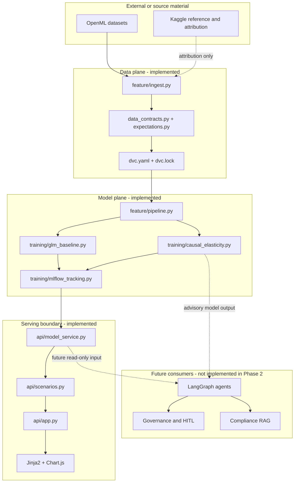

### 3.2 Ownership rules

| Boundary | Owns | Must not own |
| --- | --- | --- |
| Ingestion | Source acquisition, canonical renaming, joining, derived fields | Model fitting or UI behavior |
| Contracts | Schema, nullability, ranges, leakage checks, blocking decisions | Feature selection or model quality claims |
| DVC | Reproducible stage graph and local artifact lineage | Business interpretation of metrics |
| Feature pipeline | Shared deterministic transformations and policy-level split | MLflow registration or HTTP concerns |
| GLM baseline | Pure-premium benchmark and parameter intervals | Causal treatment-effect claims |
| Causal model | Synthetic treatment, heterogeneous effects, refutations, causal artifact | Regulatory approval or publication |
| MLflow helpers | Runs, metrics, artifacts, model registration | Serving-time scenario semantics |
| Model service | Read registered metadata and reject incomplete payloads | Retraining or mutation of model artifacts |
| Showcase | Curated presentation and graceful HTTP errors | Rate publication, free-form pricing, or governance approval |

## 4. Data architecture

### 4.1 Source and canonicalization flow

The source consists of two public tables. The frequency table supplies policy-level exposure and claim counts; the severity table supplies claim amounts for policies with claims. `clean_and_merge_fremtpl2` maps source names into the AEGIS contract and creates the fields expected by later stages.

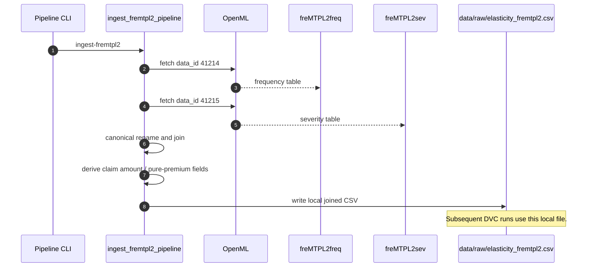

Canonical mapping:

| Source field | AEGIS field | Reason |
| --- | --- | --- |
| `IDpol` | `policy_id` | Stable grouping and policy-level split |
| `DrivAge` | `driver_age` | Driver feature contract |
| `VehAge` | `veh_age` | Vehicle feature contract |
| `ClaimNb` | `claim_count` | Frequency response |
| `Exposure` | `exposure` | Exposure weighting and offset |
| `ClaimAmount` | `claim_amount` | Severity and pure-premium construction |

The public dataset does not observe charged premium or annual mileage. ADR-019 records that `annual_mileage` is not substituted with `Density`, and that the model target is derived pure premium rather than an observed charged premium.

### 4.2 Contract-before-versioning pattern

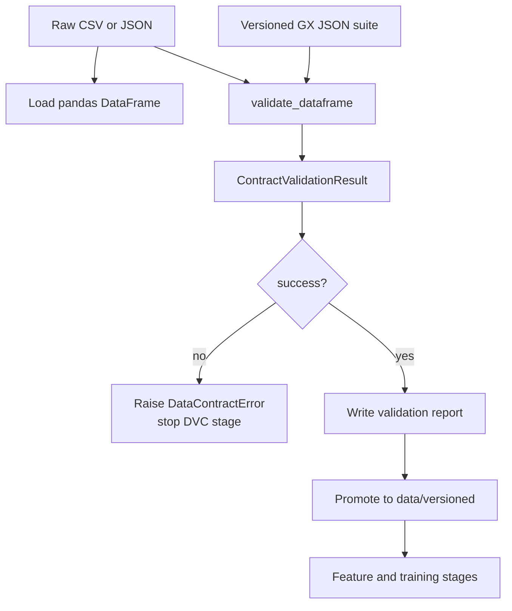

This is a hard dependency, not a reporting convention. A failed validation cannot be versioned as an approved downstream input. The custom `ExpectNoPostTreatmentLeakage` expectation extends the contract with causal-specific protection against variables such as post-policy cancellation or churn proxies.

### 4.3 DVC stage graph

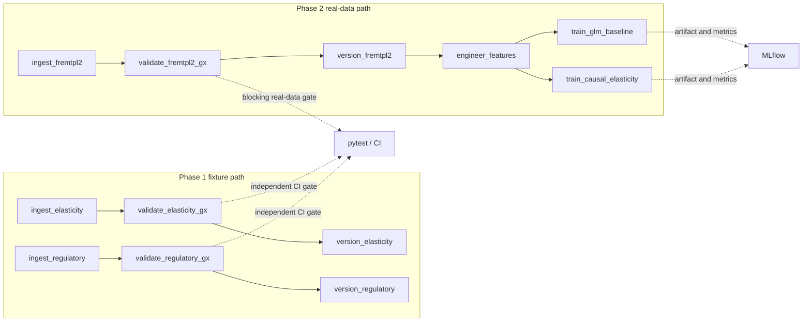

The GLM and causal stages are parallel consumers of the same feature matrix. They should not be chained as though one model's output were an input to the other; the GLM is the comparison baseline, while the causal model is the treatment-effect estimator.

## 5. Feature architecture

### 5.1 Shared transformation pipeline

The feature pipeline is the training-serving parity boundary. Both offline models and the eventual API path must use the same transformation logic rather than maintaining separate feature calculations.

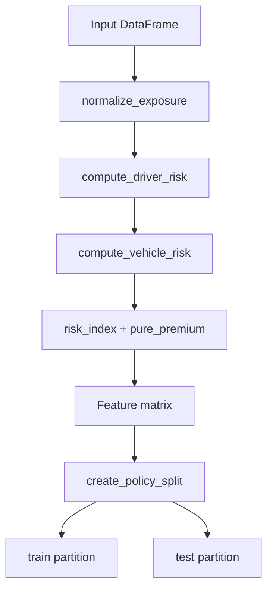

The transformation is deterministic because it is a pure DataFrame-to-DataFrame operation for a fixed input and configuration. Determinism is tested directly, not inferred from the implementation style.

### 5.2 Leakage-safe split

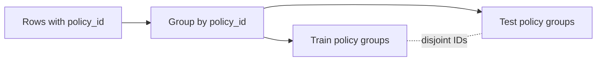

A row-level random split could place repeated observations from the same policyholder into both partitions. The grouped split keeps policy identity on one side of the boundary, limiting optimistic evaluation caused by policy leakage.

## 6. Model architecture

### 6.1 Tweedie GLM baseline

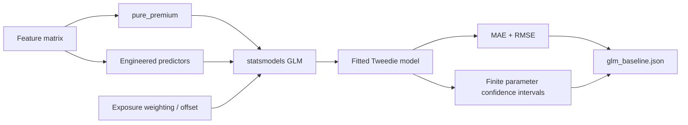

The baseline provides the actuarial reference point for pure-premium calibration. It is not a causal model and its parameter intervals are not treatment-effect intervals. This distinction is preserved in the evaluation report and prevents a predictive benchmark from being presented as causal evidence.

### 6.2 Synthetic-treatment causal validation

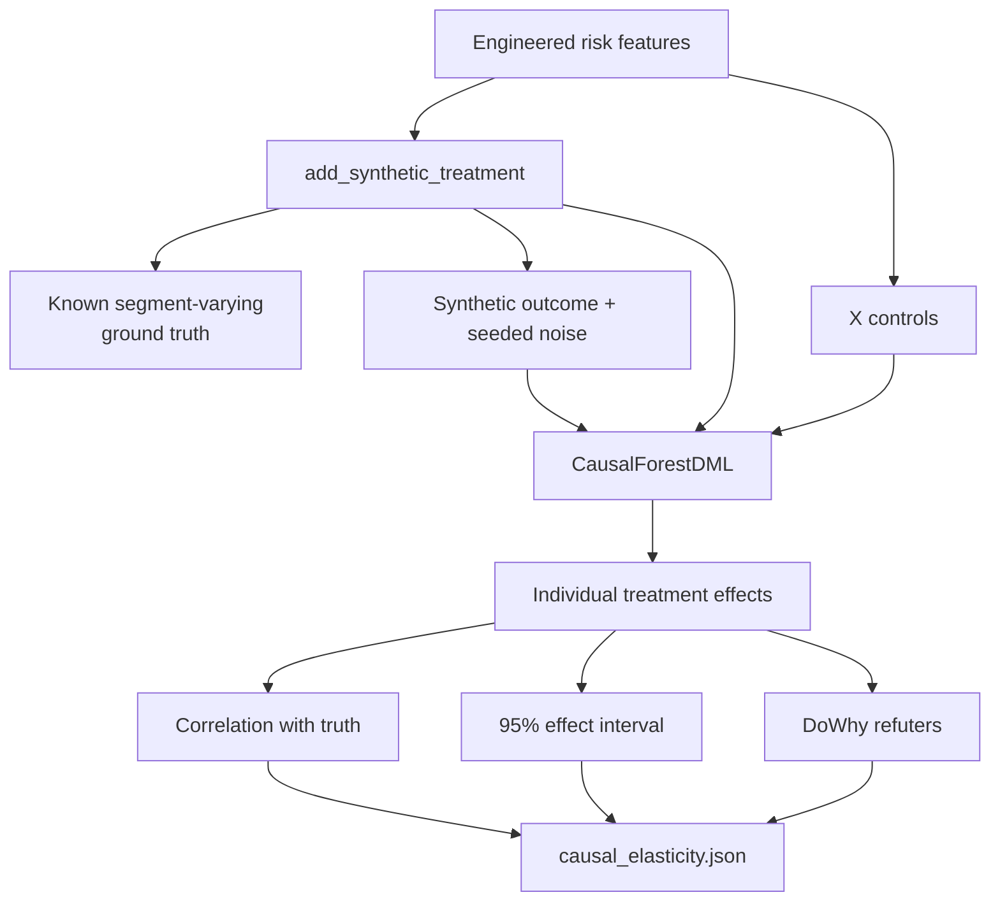

The causal path has two validation surfaces:

1. **Estimator recovery:** compare estimated heterogeneous effects with the known synthetic construction.
2. **Sensitivity evidence:** run placebo-treatment, random-common-cause, and data-subset refuters and preserve their structured outputs.

The artifact is intentionally advisory. It demonstrates that the pipeline can produce and evaluate a causal estimator under a controlled construction; it does not establish a production rate-change effect.

### 6.3 Model comparison boundary

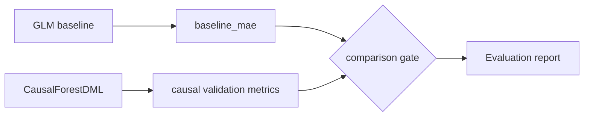

The comparison is recorded in artifacts and the evaluation report. It is not implemented as a hidden runtime decision that approves or publishes a price.

## 7. MLflow architecture

### 7.1 Tracking and registration flow

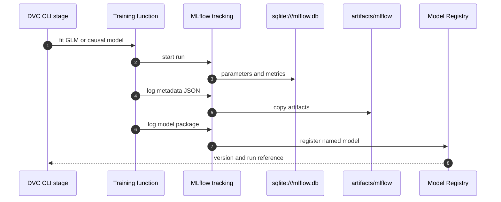

Approved registered names:

- `aegis-glm-baseline`
- `aegis-causal-elasticity`

The causal run carries the structured DoWhy diagnostic artifact and model package metadata. The SQLite backend is required because the default MLflow file store does not provide the needed Model Registry behavior.

### 7.2 Serving-time registry contract

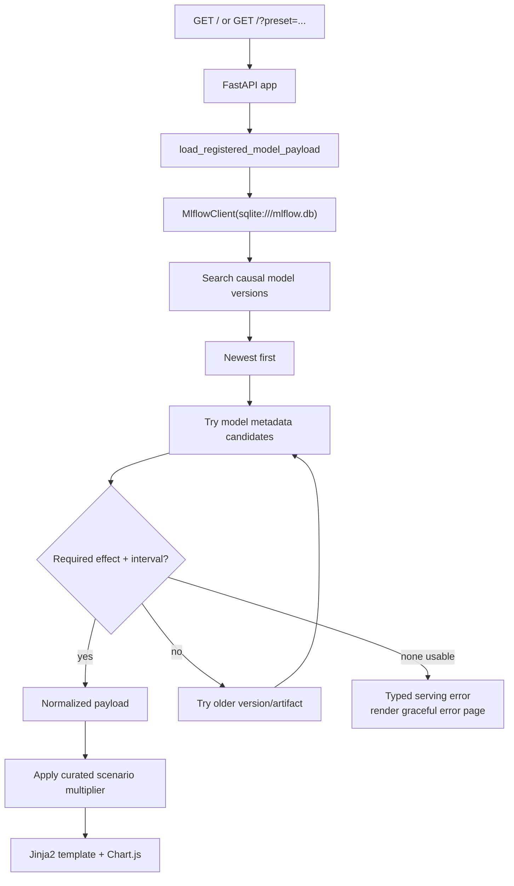

The loader does not accept a partial registry payload. It requires both `average_treatment_effect` and `treatment_effect_confidence_interval`, including when those values must be normalized from nested calibration metadata. This protects the UI from stale or incomplete model versions.

## 8. Showcase architecture

### 8.1 Request path

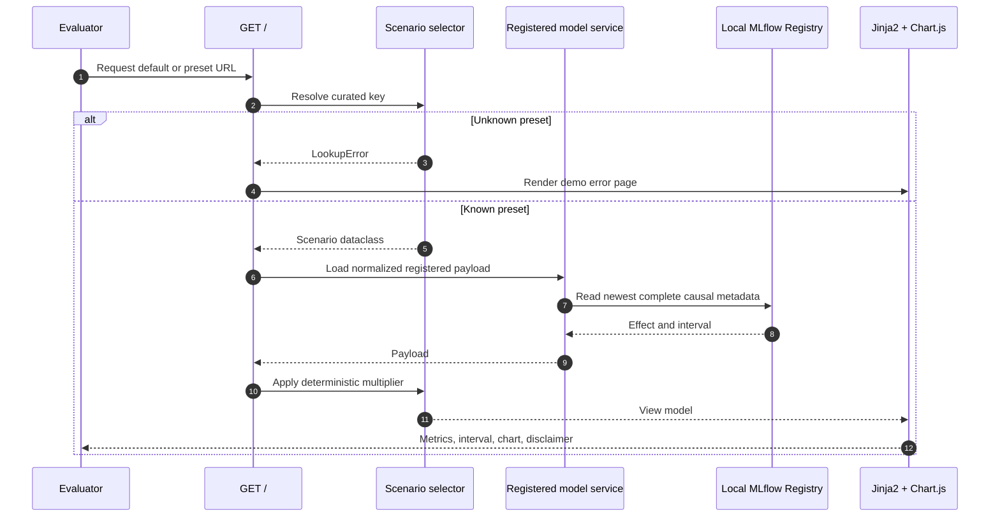

The three Phase 2 scenarios are fixed and read-only:

| Scenario | Purpose | Multiplier |
| --- | --- | ---: |
| Young Urban Commuter | Higher-frequency urban exposure | 1.18x |
| Experienced Rural Driver | Lower-risk rural exposure | 0.82x |
| High-Mileage Commercial Driver | High-exposure escalation candidate | 1.00x |

The multiplier is a showcase presentation mechanism. It is not a rate recommendation, a policy quote, or an authorization to publish a rate table.

### 8.2 Failure behavior

The application handles an unknown preset by returning a usable HTTP 200 page containing an error message and a link to the default route. Registry failures are also rendered through the same page-level error path. The service never fabricates missing causal values to make the chart render.

Every reachable showcase route exposes the demo label:

```text
DEMO - NOT FOR PRODUCTION PRICING
```

## 9. Design patterns used in Phase 2

| Pattern | Where used | Why it matters |
| --- | --- | --- |
| Contract-before-promotion | GX validation before DVC versioning | Prevents invalid data from becoming a trusted input |
| Pipeline as DAG | `dvc.yaml` | Makes dependencies, cache boundaries, and reproduction explicit |
| Single source of feature truth | `build_feature_matrix` | Preserves training-serving parity |
| Grouped evaluation split | `create_policy_split` | Prevents policy-level leakage across train and test |
| Baseline-plus-differentiator | Tweedie GLM plus CausalForestDML | Gives causal validation a concrete actuarial reference |
| Synthetic ground-truth validation | `add_synthetic_treatment` | Makes estimator recovery falsifiable without claiming real-world causality |
| Artifact-first provenance | JSON artifacts plus MLflow | Keeps metrics and refutation outputs inspectable and reproducible |
| Newest complete version | `load_registered_model_payload` | Avoids serving stale or partial registry metadata |
| Curated scenario presentation | `scenarios.py` | Keeps the showcase controlled and explicitly non-production |
| Fail-loud data and model contracts | `DataContractError` and payload validation | Prevents silent degradation at critical boundaries |

## 10. Step-by-step technical implementation

### Step 1 - Establish the contract and source mapping

1. Declare the Phase 2 dependencies in `pyproject.toml` and lock them with `uv.lock`.
2. Record the freMTPL2 schema decision in ADR-019.
3. Keep the expectation suite declarative and versioned under `data_contracts/`.
4. Define the canonical source-to-AEGIS rename mapping.

### Step 2 - Implement one-time ingestion

1. Fetch `freMTPL2freq` and `freMTPL2sev` through `fetch_openml`.
2. Join the tables on `policy_id` after canonical renaming.
3. Derive the fields required by the training contract.
4. Write `data/raw/elasticity_fremtpl2.csv`.
5. On later runs, use the existing local file so DVC reproduction does not require OpenML.

### Step 3 - Put validation before promotion

1. Load the JSON expectation suite into an ephemeral Great Expectations context.
2. Validate the DataFrame and collect a structured result.
3. Write the validation report.
4. Raise `DataContractError` on failure.
5. Permit version promotion only after success.

### Step 4 - Build shared features

1. Normalize exposure.
2. Compute driver risk features.
3. Compute vehicle risk features.
4. Derive the risk index and pure-premium target.
5. Split by policy group.
6. Assert deterministic output and expected columns in tests.

### Step 5 - Fit the GLM reference model

1. Prepare the target and feature columns.
2. Fit a statsmodels Tweedie GLM on the training partition.
3. Evaluate held-out MAE and RMSE.
4. Extract parameter confidence intervals.
5. Reject non-finite intervals.
6. Save `data/validated/glm_baseline.json`.
7. Log and register the model through the MLflow helper.

### Step 6 - Fit and validate the causal model

1. Add the seeded synthetic treatment and known heterogeneous effect construction.
2. Reuse the shared features and grouped split.
3. Fit `CausalForestDML`.
4. Estimate treatment effects and confidence intervals.
5. Compare recovered effects with the synthetic ground truth.
6. Run the three DoWhy refuters.
7. Save `data/validated/causal_elasticity.json`.
8. Log diagnostics and register the causal model.

### Step 7 - Attach evaluation provenance

1. Assemble the evaluation report from the saved artifacts.
2. Include dataset attribution and the validation-not-discovery limitation.
3. Attach the report to the verified causal MLflow run.
4. Compare the repository report with the downloaded MLflow artifact byte-for-byte.

### Step 8 - Serve registered output

1. Bind the model service to `sqlite:///mlflow.db`.
2. Search registered versions newest-first.
3. Inspect candidate metadata artifacts.
4. Normalize nested payloads.
5. Return only a complete effect-and-interval payload.
6. Apply a curated scenario multiplier.
7. Render the Jinja2 page and Chart.js visualization.
8. Render a graceful demo error for malformed preset input.

### Step 9 - Close the phase with gates

1. Run `uv run pytest -q`.
2. Run `uv run ruff check .`.
3. Run `uv run pyright`.
4. Run `python scripts/check_module_size.py`.
5. Run `uv run dvc repro`.
6. Inspect the registry and artifacts when a serving test fails.
7. Record gate evidence in `phase_2_execution_workflow.md`.

## 11. Verification matrix

| Architectural claim | Verification | Result |
| --- | --- | --- |
| Raw data is contract-gated | Real freMTPL2 GX report | 12/12 expectations passed |
| Features are deterministic | `test_build_feature_matrix_is_deterministic` | Passed |
| Policy leakage is blocked | `test_create_policy_split_has_no_overlap` | Passed |
| GLM is a usable reference | `test_tweedie_baseline_fits_with_finite_intervals` | Passed |
| Causal path is falsifiable | `test_fit_causal_elasticity_recovers_ground_truth` | Passed |
| Registry integration exists | `test_track_and_register_model_logs_registry_version_and_artifact` | Passed |
| Showcase is controlled | Four showcase route tests | Passed |
| Full phase remains healthy | `uv run pytest -q` | 54 passed |
| Static quality is enforced | Ruff, Pyright, module-size checker | Passed |
| DVC graph reproduces | `uv run dvc repro` | Passed |

## 12. Phase 2 architectural conclusion

Phase 2 produces a governed deterministic foundation, not the complete AEGIS decision system. Its most important architectural achievement is the chain of explicit boundaries:

```text
contract -> version -> transform -> compare -> register -> serve
```

Each boundary has a named owner, a persisted artifact or registry record, and a testable failure mode. The architecture is ready for later consumers to add compliance, revenue-impact, orchestration, and HITL behavior without moving causal estimation into an LLM prompt or allowing a showcase route to become an accidental production pricing path.

The next phases may consume the registered causal output, but they must preserve the Phase 2 guarantees: deterministic tools remain deterministic, causal output remains advisory, model provenance remains inspectable, and no downstream component may publish a live rate without the governance and human-review controls defined elsewhere in AEGIS.
