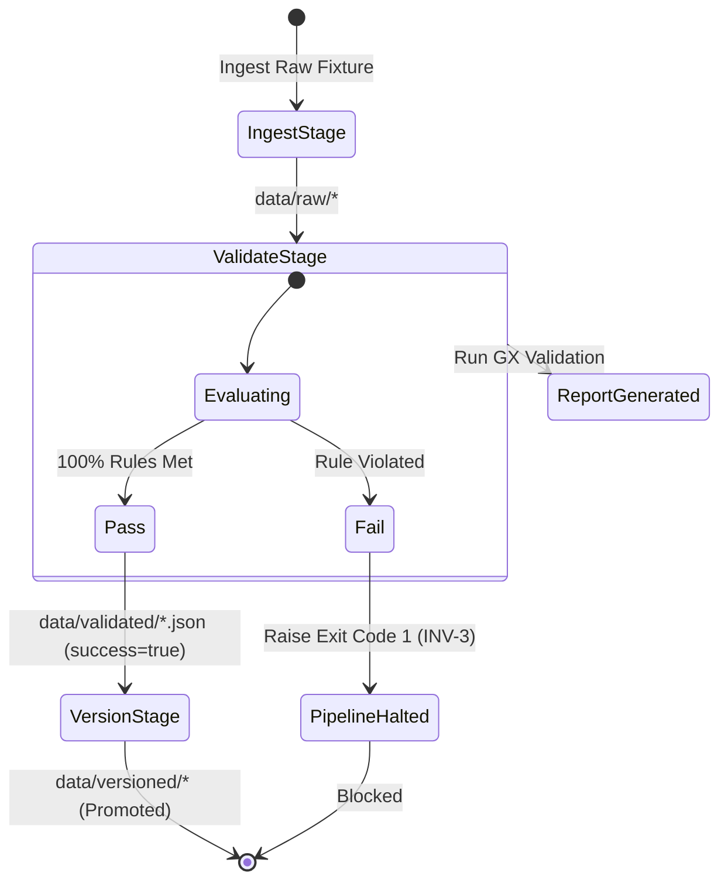

# Phase 1 Evaluation Report — AEGIS

> **System:** Actuarial Elasticity & Governance Intelligence System (AEGIS)  
> **Phase:** Phase 1 — Project Scaffolding & Data Contracts  
> **Type:** System Mechanics Evaluation & Sanity Review  
> **Status:** 🟢 All Verification Gates Evaluated & Passed  
> **Author:** Sebastián Garrido Arévalo | Date: August 21, 2026  
> **Related Documents:** [phase_1_architecture_report.md](../architecture/phase_1_architecture_report.md), [test_suite_report.md](test_suite_report.md), [system_design.md](../architecture/system_design.md)

---

## 1. Sanity Review Scope & Objective

This evaluation report demonstrates **how Phase 1 functions in practice**, detailing the step-by-step mechanics of data intake, contract validation, custom causal leakage detection, pipeline DAG execution, and CI falsification gating.

The primary objective of this review is to provide empirical, reproducible evidence that Phase 1's validation gates are load-bearing, deterministic, and strictly enforce the system invariants before Tier 1 modeling commences.

---

## 2. System Mechanics Breakdown

### 2.1 Configuration Loading Mechanics

The configuration subsystem (`src/aegis/config/`) resolves project root and executes schema validation through the following deterministic procedure:

1. **Root Discovery:** `find_project_root()` inspects the current working directory and traverses parent directories until locating `params.yaml` or `pyproject.toml`.
2. **UTF-8 YAML Parsing:** `load_params()` reads `params.yaml` via PyYAML.
3. **Pydantic Validation:** The parsed dictionary is validated through `AEGISConfig.model_validate()`. Missing required keys, invalid types, or unauthorized extra keys raise a typed `ConfigurationError`.
4. **LRU Caching:** `get_config()` caches the validated `AEGISConfig` instance in-memory to prevent repeated disk I/O.

```python
# Execution Demonstration:
from aegis.config.loader import get_config

config = get_config()
print(f"Data Contracts Fixtures: {config.data_contracts.fixtures_dir}")
print(f"DVC Remote: {config.dvc.remote_name} -> {config.dvc.remote_url}")
```

---

### 2.2 Great Expectations Core In-Memory Validation Mechanics

Data contract validation (`src/aegis/pipelines/data_contracts.py`) evaluates tabular data against version-controlled JSON expectation suites:

1. **Context Initialization:** Initializes an in-memory ephemeral context via `gx.get_context(mode="ephemeral")`.
2. **Suite Deserialization:** Reads native JSON suites and registers them into the context using `gx.ExpectationSuite(**suite_dict)`.
3. **Batch Creation:** Dynamically binds an in-memory Pandas DataFrame batch:
   - Registers a named `PandasDatasource`.
   - Binds a `DataframeAsset`.
   - Creates a whole-dataframe `BatchDefinition` and requests the active batch.
4. **Validation Run:** Invokes `batch.validate(suite)`.
5. **Structured Result Parsing:** Iterates through individual expectation results, extracting observed values, failure parameters, and rule descriptions into a frozen `ContractValidationResult` dataclass.

---

### 2.3 Custom Causal Leakage Detection Mechanics

Post-treatment variable leakage invalidates causal elasticity modeling. To guard against this, `ExpectNoPostTreatmentLeakage` (`src/aegis/pipelines/expectations.py`) operates as follows:

1. **Metric Dependency:** Declares `metric_dependencies = ("table.columns",)`.
2. **Table Schema Inspection:** Retrieves the runtime table column list from the GX execution engine metrics.
3. **Prohibited Set Intersection:** Computes `actual_columns.intersection(prohibited_columns)`.
4. **Deterministic Evaluation:** If any prohibited column exists (e.g., `post_treatment_retention`, `renewal_decision`, `churn_flag`), validation returns `success = False` with a structured list of leaked columns.

```json
// Result Payload on Leakage Detection:
{
  "expectation_type": "expect_no_post_treatment_leakage",
  "success": false,
  "result": {
    "observed_value": ["policy_id", "driver_age", "exposure", "post_treatment_retention", "churn_flag"],
    "details": {
      "prohibited_columns": ["churn_flag", "post_loss_settlement", "post_policy_cancellation", "post_treatment_retention", "renewal_decision"],
      "leaked_columns": ["churn_flag", "post_treatment_retention"]
    }
  }
}
```

---

### 2.4 DVC Pipeline DAG Execution & Lock Mechanics

The pipeline runner CLI (`src/aegis/pipelines/cli.py`) translates GX outcomes into blocking exit codes for DVC:

1. **Stage 1 (`ingest`):** Copies raw source fixture to `data/raw/`.
2. **Stage 2 (`validate_gx`):** Executes validation against the expectation suite, dumps a structured JSON report to `data/validated/`, and exits with code 1 if validation fails (blocking the DAG).
3. **Stage 3 (`version`):** Verifies that the validation report exists and has `success: true`. If valid, copies the raw dataset to `data/versioned/`.



---

## 3. Data Contract Fixture Verification Matrix

Every fixture was tested against its corresponding suite to ensure positive conformance and exact single-rule failure isolation.

| Fixture File | Suite Tested | Expected Outcome | Observed Outcome | Tripped Expectation Rule |
| :--- | :--- | :---: | :---: | :--- |
| `regulatory_valid.json` | `regulatory_corpus_suite.json` | 🟢 PASS | 🟢 PASS (9/9 Passed) | None (Clean validation) |
| `regulatory_invalid_missing_meta.json` | `regulatory_corpus_suite.json` | 🔴 FAIL | 🔴 FAIL (1/9 Failed) | `expect_column_values_to_not_be_null` on column `'effective_date'` |
| `regulatory_invalid_empty.json` | `regulatory_corpus_suite.json` | 🔴 FAIL | 🔴 FAIL (1/9 Failed) | `expect_column_value_lengths_to_be_between` on column `'chunk_text'` |
| `regulatory_invalid_duplicate.json` | `regulatory_corpus_suite.json` | 🔴 FAIL | 🔴 FAIL (1/9 Failed) | `expect_column_values_to_be_unique` on column `'chunk_id'` |
| `elasticity_valid.csv` | `elasticity_training_suite.json` | 🟢 PASS | 🟢 PASS (12/12 Passed) | None (Clean validation) |
| `elasticity_invalid_range.csv` | `elasticity_training_suite.json` | 🔴 FAIL | 🔴 FAIL (1/12 Failed) | `expect_column_values_to_be_between` on column `'exposure'` |
| `elasticity_invalid_leakage.csv` | `elasticity_training_suite.json` | 🔴 FAIL | 🔴 FAIL (1/12 Failed) | `expect_no_post_treatment_leakage` on table columns |

---

## 4. Falsification Pass Audit

To confirm that every CI gate is load-bearing and not decorative, a deliberate falsification pass was executed across all five pipeline gates:

```text
+-----------------------------------------------------------------------------------------------+
|                               FALSIFICATION PASS AUDIT MATRIX                                  |
+--------+----------------------------+------------------------------+---------------+----------+
| Gate   | Injected Failure           | Failure Symptom Observed     | Exit Code     | Reversion|
+--------+----------------------------+------------------------------+---------------+----------+
| Gate 1 | Unused import in utils     | Ruff error F401              | Exit Code 1   | Verified |
| Gate 2 | Return type mismatch       | Pyright return type error    | Exit Code 1   | Verified |
| Gate 3 | 1,001-line dummy module    | INV-8 violation logged       | Exit Code 1   | Verified |
| Gate 4 | Injected bad exposure data | DVC validate_gx stage halted | Exit Code 1   | Verified |
| Gate 5 | Broken pytest assertion    | Pytest AssertionError logged | Exit Code 1   | Verified |
+--------+----------------------------+------------------------------+---------------+----------+
```

---

## 5. Post-Implementation Remediation Summary

During the final review, four findings were identified, remediated, and verified:

1. **R-1 (Duplicate Fixture Isolation):** Differentiated `chunk_text` across duplicate ID rows in `regulatory_invalid_duplicate.json` so that only `expect_column_values_to_be_unique(column="chunk_id")` fires.
2. **R-2 (Schema Forward-Specification):** Added `default_factory` to `AEGISConfig` and explicit defaults for future tiers, keeping `DataContractsConfig` strictly required.
3. **R-3 (DVC Config Cleanup):** Removed unreferenced stage-name literals from `DVCConfig` in `schema.py` and `params.yaml`.
4. **R-4 (CLI Parameter Drift Prevention):** Refactored `cli.py` to resolve argument defaults dynamically from `get_config()`.

---

## 6. Evaluation Verdict

Phase 1 successfully meets all stated exit criteria:
- **Scaffolding:** Namespaced package, strict typing, and zero secrets verified.
- **Data Contracts:** 100% pass on valid fixtures; 100% isolated failures on malformed fixtures.
- **DVC Integration:** Parallel DAGs execute and block downstream promotion on bad data.
- **CI/CD:** Multi-gate workflow with 100% passing falsification pass.

**Verdict: Phase 1 is officially validated and ready for Phase 2.**
