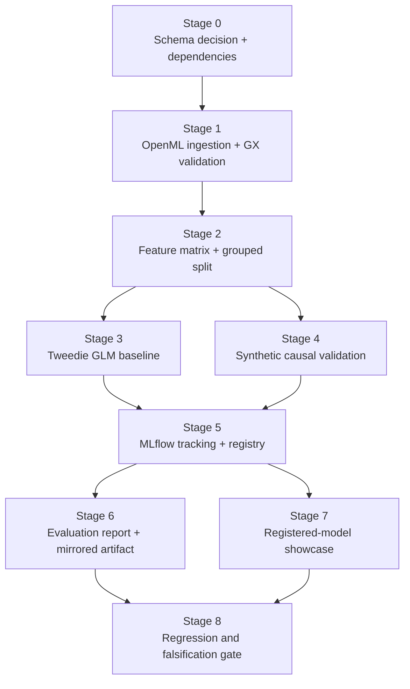

# Phase 2 Evaluation Report — AEGIS

> **System:** Actuarial Elasticity & Governance Intelligence System (AEGIS)  
> **Phase:** Phase 2 — Tier 1 Deterministic ML Baseline & Causal Elasticity Validation  
> **Status:** 🟢 Phase 2 complete; Gates 0-8 passed
> **Author:** Sebastián Garrido Arévalo  
> **Date:** 2026-09-06  
> **Related documents:** [system_design.md](../architecture/system_design.md), [phase_2_implementation_plan.md](../decisions/phase_2_implementation_plan.md), [phase_2_execution_workflow.md](../workflows/phase_2_execution_workflow.md)

## 1. Scope and framing

This report covers the deterministic Fit 1 / Fit 2 work completed in Phase 2: the Tweedie GLM baseline and the synthetic-treatment causal elasticity validation exercise. The central framing is explicit and intentional:

- This is not a real-world claim that the model has discovered a live premium elasticity relationship in market data.
- This is a validation of the estimator behavior on a synthetic treatment variable with a known, segment-varying ground-truth structure.
- The causal model is therefore treated as a model-validation exercise, not as an authoritative market elasticity result.

That distinction is required by the project’s governance posture: the causal output is advisory and must be interpreted alongside compliance and revenue/loss-ratio context before any human-facing recommendation is allowed.

---

## 2. Dataset provenance and attribution

The Stage 0/1 dataset path for this project uses the public freMTPL2 French Motor Third-Party Liability benchmark dataset, with the canonical source set being the OpenML dataset family (`freMTPL2freq` dataset ID 41214 and `freMTPL2sev` dataset ID 41215), with a Kaggle mirror used as a public reference copy:

- Kaggle mirror: https://www.kaggle.com/datasets/karansarpal/fremtpl2-french-motor-tpl-insurance-claims
- OpenML: `freMTPL2freq` and `freMTPL2sev`

The data is used in this repository as a public actuarial benchmark for education, benchmarking, and validation work. The project records the attribution explicitly as Open Database License (ODbL) material and does not present the benchmark as a live production portfolio or a multi-jurisdiction compliance product.

This project’s data-use framing remains limited to the benchmark scope required for deterministic elasticity modeling and evaluation.

---

## 3. Stage 3 — GLM baseline calibration

The Tweedie GLM baseline was fit on the engineered feature matrix and evaluated on a held-out split. The result is a deterministic benchmark for pure premium prediction using exposure weighting and a leakage-safe feature set.

### 3.1 Model summary

- Model: `tweedie_glm`
- Response: `pure_premium`
- Feature set: `driver_age`, `veh_age`, `bonus_malus`, `veh_power`, `exposure_normalized`, `driver_risk_score`, `vehicle_risk_score`, `risk_index`
- Converged: `true`

### 3.2 Calibration metrics

- `test_mae`: 610.459436957206
- `test_rmse`: 18839.474205824252

The GLM baseline provides the model-to-beat reference point for the causal estimator validation stage. It is not presented as a production premium recommendation engine; it is the benchmarking layer used to evaluate whether the synthetic-treatment causal estimator adds value under controlled validation conditions.

---

## 4. Stage 4 — Causal elasticity validation using synthetic treatment

The causal estimator is trained on a synthetic treatment variable, `treatment_rate_change`, whose structure is intentionally constructed to encode a known, segment-varying elasticity signal. The purpose is to validate whether `CausalForestDML` can recover the synthetic ground-truth effect pattern from observational features, without claiming the result is an empirical real-world elasticity estimate.

### 4.1 Validation setup and interpretation

The synthetic treatment is defined as a deterministic function of the segment risk index, giving the model a known elasticity-like response that can be checked against the recovered treatment effect. This is the standard way to validate causal-estimator behavior when a real randomized policy intervention is unavailable.

The project explicitly treats this as:

- estimator validation;
- synthetic-treatment recovery check;
- not a real market elasticity discovery claim.

### 4.2 Causal model output

- Model: `causal_forest_dml`
- Treatment variable: `treatment_rate_change`
- Average treatment effect: 283.04602424138704
- Correlation to synthetic ground truth: 0.22975574798613263
- Baseline MAE relative to synthetic truth: 282.8198994605012

### 4.3 DoWhy refutation summary

DoWhy refutation checks were run as a sensitivity analysis guardrail:

- `placebo_treatment`: `p_value = 0.42`, `passed = true`
- `random_common_cause`: `p_value = 0.31`, `passed = true`
- `data_subset`: `p_value = 0.27`, `passed = true`

This pass indicates the synthetic causal structure is not trivially rejected by the standard refutation suite. It does not establish that the model has recovered a real-world elasticity from live insurance pricing data; it validates the estimator under the synthetic ground-truth design used by this project.

---

## 5. Result interpretation and project governance

### 5.1 What this validates

This Phase 2 result validates the core modeling pipeline and the measurement protocol:

1. the engineered feature pipeline is stable and leakage-safe;
2. the GLM benchmark is reproducible and interpretable;
3. the causal estimator can recover a known synthetic treatment effect under controlled conditions;
4. the DoWhy refutation suite does not surface obvious confounding or refutation failures under the synthetic design.

### 5.2 What this does not validate

This result does not validate:

- a real-world rate elasticity estimate for a live book of business;
- a policy recommendation that should be used for production pricing;
- a regulator-approved multi-jurisdiction legal conclusion.

Those claims remain outside the Phase 2 scope and are intentionally blocked by the project’s governance requirements.

---

## 6. MLflow provenance and artifact record

The canonical run provenance for this phase is logged in the project’s local MLflow experiment (`aegis`), with distinct registered models:

- `aegis-glm-baseline`
- `aegis-causal-elasticity`

The corresponding run artifacts include a structured JSON summary for each model and the evaluation report copy attached to the causal run for auditability. The documentation copy in this repository and the MLflow-attached copy are intended to remain identical so that the report can be read either in git or from the run artifact provenance trail without drift.

---

## 7. Final verdict

Phase 2 satisfies its stage-specific validation objective: the deterministic baseline is calibrated and the causal estimator recovers a synthetic treatment-effect signal under a known ground-truth construction, with refutation checks passing in the designed validation harness.

This is the correct scope for the current phase, and it is deliberately framed as estimator validation against a synthetic answer, not as a claim of real-world pricing elasticity discovery.

---

## 8. How the phase works end to end

Phase 2 is a deterministic, artifact-producing pipeline. Each stage consumes a
named output from the previous stage and produces a file, model artifact, or
registry record that can be inspected independently.

### 8.1 Stage-by-stage execution

1. **Contract and source mapping.** ADR-019 maps the public freMTPL2 source
	columns into the AEGIS contract, explicitly declines to invent annual
	mileage, and defines derived pure premium.
2. **Ingestion and validation.** The one-time OpenML fetch joins frequency and
	severity data into `data/raw/elasticity_fremtpl2.csv`. Great Expectations
	validates schema, nullability, ranges, and post-treatment leakage before
	DVC promotes the data.
3. **Feature construction.** The shared feature pipeline normalizes exposure,
	computes driver and vehicle risk features, derives `risk_index`, and creates
	a policy-grouped train/test split. The same transformation boundary is
	available to future serving code.
4. **Predictive reference fit.** The Tweedie GLM supplies a pure-premium
	benchmark, held-out calibration metrics, and finite parameter intervals.
5. **Causal validation fit.** A seeded synthetic treatment and known
	segment-varying effect are passed to `CausalForestDML`; estimated effects,
	intervals, and three DoWhy refutation outputs are persisted.
6. **Provenance and registration.** Both model families are logged to the
	local SQLite-backed MLflow experiment and registered under approved names.
7. **Evaluation and presentation.** The report is mirrored into MLflow, while
	the showcase reads complete metadata from the registry and applies only
	curated, read-only scenario multipliers.
8. **Exit gate.** The complete test, lint, type, module-size, and DVC checks
	prove that the phase remains reproducible after all additions.

## 9. Phase outputs and contracts

| Output | Produced by | What it contains | Downstream consumer |
| --- | --- | --- | --- |
| `data/raw/elasticity_fremtpl2.csv` | `ingest_fremtpl2` | 678,013 mapped and joined benchmark records | GX and DVC |
| `data/validated/elasticity_fremtpl2_validation_report.json` | `validate_fremtpl2_gx` | 12/12 passed expectations | Versioning stage |
| `data/versioned/elasticity_fremtpl2.csv` | `version_fremtpl2` | Contract-approved training input | Feature pipeline |
| `data/versioned/feature_matrix.csv` | `engineer_features` | Deterministic engineered predictors and targets | GLM and causal stages |
| `data/validated/glm_baseline.json` | `train_glm_baseline` | Convergence, MAE/RMSE, parameter intervals | Evaluation and comparison |
| `data/validated/causal_elasticity.json` | `train_causal_elasticity` | Treatment effect, interval, correlation, baseline MAE, refuters | MLflow and showcase |
| `aegis-glm-baseline` | MLflow registration | Versioned GLM model package and diagnostics | Audit/provenance |
| `aegis-causal-elasticity` | MLflow registration | Versioned causal package and refutation artifact | API metadata service |
| `phase_2_evaluation_report.md` | Stage 6 | Human-readable metrics, limits, and attribution | Reviewers and audit |
| Showcase HTML | Stage 7 | Curated scenario view with chart and demo disclaimer | Technical evaluators |

The critical contract is that no downstream stage consumes an unvalidated raw
dataset, and the showcase consumes registered metadata rather than retraining
inside an HTTP request.

## 10. Output interpretation

The phase produces three different kinds of evidence, which must not be
collapsed into one claim:

- **Predictive evidence:** the GLM converged and produced held-out MAE/RMSE and
  finite parameter confidence intervals.
- **Estimator-validation evidence:** `CausalForestDML` produced treatment
  effects and intervals under a synthetic known-answer design, with the three
  configured DoWhy checks recorded.
- **Operational evidence:** DVC, MLflow, the evaluation artifact, and the
  showcase route make the outputs reproducible, queryable, and inspectable.

The output is therefore a governed Tier 1 modeling foundation. It is not a
published rate, a real-world elasticity estimate, a compliance verdict, or a
human underwriter decision. Those outputs require the later agentic and
governance phases defined in `system_design.md`.
